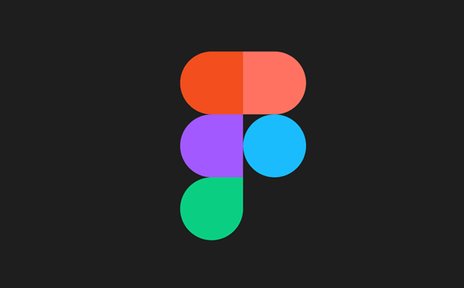

<h1 align="center">👋 Hi, I'm <strong>Kim Hyun Seop</strong></h1>

  기술적 이해를 바탕으로 문제를 구조화하고, 데이터와 사용자 관점에서 서비스를 설계하는

<h2 align="center">
  <strong>Service Planner & Product Manager</strong>
</h2>

 

  📫 <strong>Contact</strong> · 
  <a href="mailto:albert4323@naver.com">albert4323@naver.com</a> · South Korea 🇰🇷

---

## 🧠 Languages & Tools

### Development

  
  
  

### Data / Analytics

  
  

### Planning / Collaboration

  
  
  
  

### AI Tools

  
  
  

